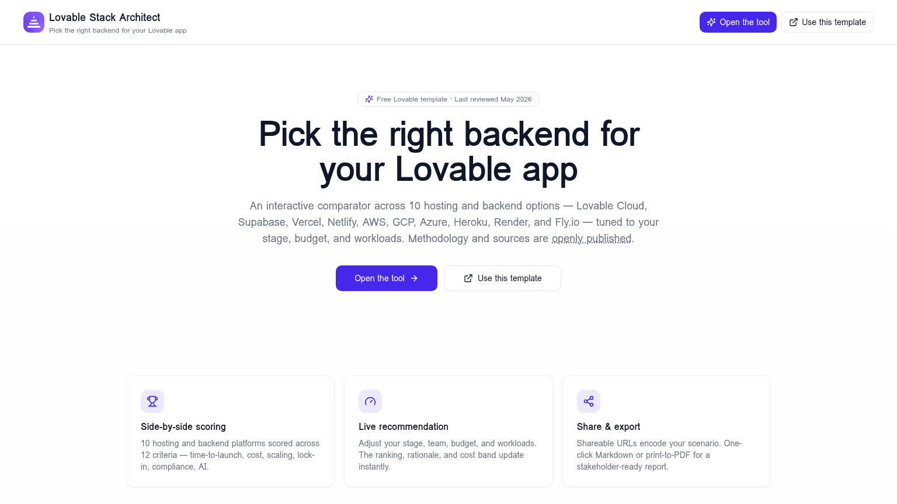
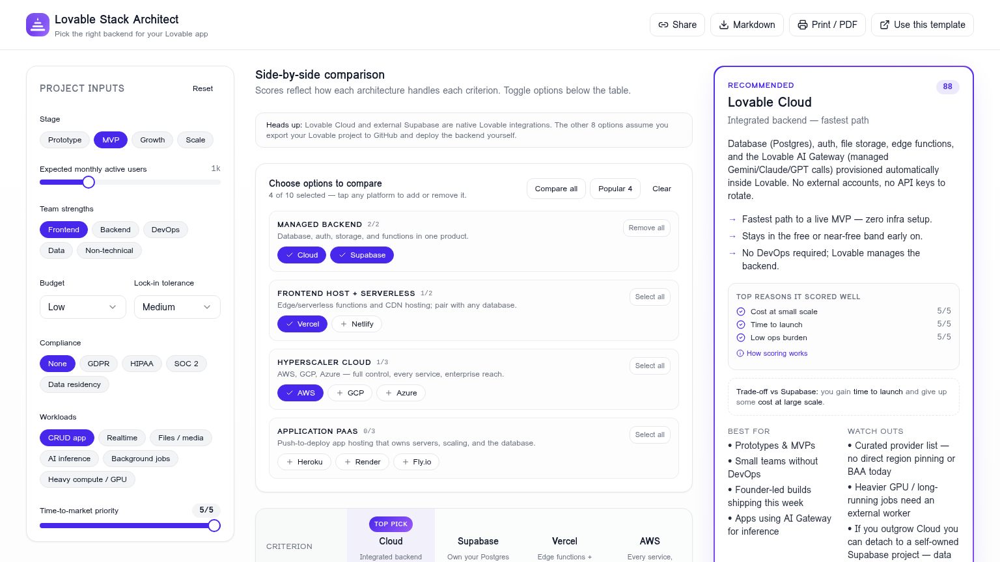
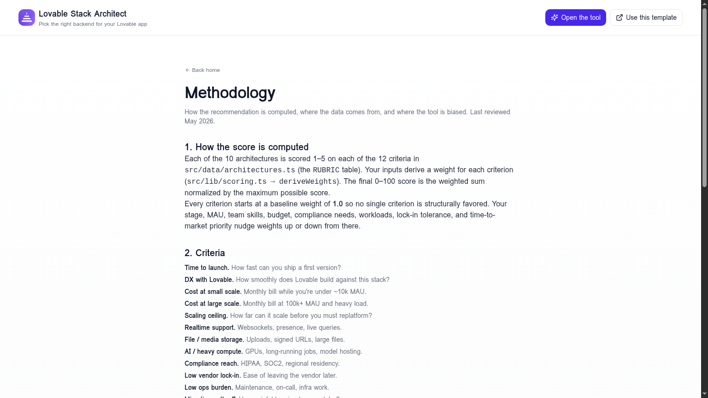
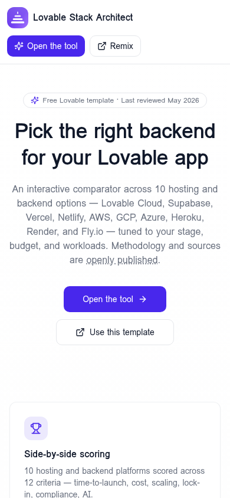

# Lovable Stack Architect

> An interactive comparator that helps you pick the best backend stack for a Lovable-built app — and a free, open-source template you can fork to build any decision tool.

[](LICENSE)
[](https://lovable.dev)

**Live demo:** <https://lovable-stack-architect.lovable.app>



## What it does

- **Side-by-side scoring** of 10 hosting and backend platforms across 12 criteria (time-to-launch, DX with Lovable, cost at small & large scale, scaling ceiling, realtime, storage, AI/heavy compute, compliance, lock-in, ops burden, migration path).
- **Live recommendation** that updates as you adjust stage, expected MAU, team strengths, budget, compliance needs, workloads, lock-in tolerance, and time-to-market priority. Each pick shows its top contributing criteria and the trade-off versus the runner-up.
- **Transparent, sourced methodology.** The rubric, weights, cost-band sources, and known biases are openly published at [`/methodology`](https://lovable-stack-architect.lovable.app/methodology).
- **Share & export.** Every scenario serializes into a share URL; one click exports a stakeholder-ready Markdown report or PDF.

Platforms covered: Lovable Cloud, external Supabase, Vercel, Netlify, AWS, Google Cloud, Azure, Heroku, Render, Fly.io. Only Lovable Cloud and external Supabase are native Lovable integrations — the other 8 assume you export to GitHub and deploy the backend yourself. The tool calls this out wherever it matters.

## Screenshots

| Tool (recommendation + matrix) | Methodology |
| --- | --- |
|  |  |

Mobile:



## Use it as a template (5-minute customization)

The whole app is data-driven. Fork it and re-aim it at any decision space (CMS picker, database picker, auth picker, AI-model picker, anything) by touching three files:

1. **`src/data/architectures.ts`** — swap the options being compared (`ARCHITECTURES`), the dimensions you score on (`CRITERIA`), and the 1–5 score for each `(option × criterion)` pair (`RUBRIC`). Add `sources`, `lastReviewed`, and `nativeIntegration` per option.
2. **`src/lib/scoring.ts`** — tune `DEFAULT_INPUTS` (what users see on first load) and the input → weight mapping (how user choices reweight each criterion).
3. **Rebrand** — edit `src/lib/constants.ts` (`LOVABLE_REMIX_URL`, `GITHUB_URL`, `SITE_URL`, `LAST_REVIEWED`), `index.html` (title, description, OG/Twitter tags, JSON-LD), and assets in `public/` (`logo.svg`, `logo-mark.svg`, favicons, `apple-touch-icon.png`, `og-image.png`, `site.webmanifest`).

That's it — the UI, scoring engine, share URLs, Markdown export, methodology page, and architecture diagram all keep working.

## Methodology & bias

This tool is Lovable-authored and lives on a Lovable-hosted site, so it has a perspective. We try to be transparent about it:

- Every criterion starts at the same baseline weight so no single criterion structurally favors any option.
- The recommendation card shows the top criteria that drove the score and the specific trade-off versus the runner-up.
- Every cost band links to its vendor source and a per-platform `lastReviewed` date.
- The full rubric, scoring formula, and known caveats live on the [Methodology page](https://lovable-stack-architect.lovable.app/methodology).

If you find a score you disagree with, the rubric lives in one file (`src/data/architectures.ts`) and is one PR away from a fix.

## Tech stack

React 18 · Vite 5 · TypeScript · Tailwind CSS · shadcn/ui · React Router · Mermaid (architecture diagrams) · lz-string (share URLs) · Vitest.

## Project structure

```
src/
├─ pages/
│  ├─ Landing.tsx         # Marketing landing at "/"
│  ├─ Index.tsx           # The comparator tool at "/app"
│  ├─ Methodology.tsx     # Transparency page at "/methodology"
│  └─ NotFound.tsx
├─ components/
│  ├─ SiteHeader.tsx       SiteFooter.tsx   SeoHead.tsx
│  ├─ InputsPanel.tsx      ComparisonMatrix.tsx
│  ├─ RecommendationCard.tsx CostEstimate.tsx
│  ├─ ArchitectureDiagram.tsx ReportExport.tsx
│  └─ ui/                  # shadcn primitives
├─ data/
│  └─ architectures.ts    # Options, criteria, rubric, cost bands, sources
└─ lib/
   ├─ scoring.ts          # Weights, scoring, runner-up trade-off
   ├─ presets.ts          # Example scenario presets
   ├─ constants.ts        # Template / brand URLs + LAST_REVIEWED
   └─ diagram.ts          # Mermaid generation
```

## Local development

```bash
npm install
npm run dev      # start the dev server
npm run build    # production build
npm run lint     # eslint
npm test         # vitest
```

## Data freshness

Cost bands and rubric scores were last reviewed **May 2026** (tracked via `LAST_REVIEWED` in `src/lib/constants.ts`, plus a per-platform `lastReviewed` field in `src/data/architectures.ts`). Pricing and platform capabilities move quickly — verify against current vendor pricing before making real decisions, and bump those dates when you re-review.

## License

[MIT](LICENSE) — fork it, ship it, sell a branded version. All fine.
